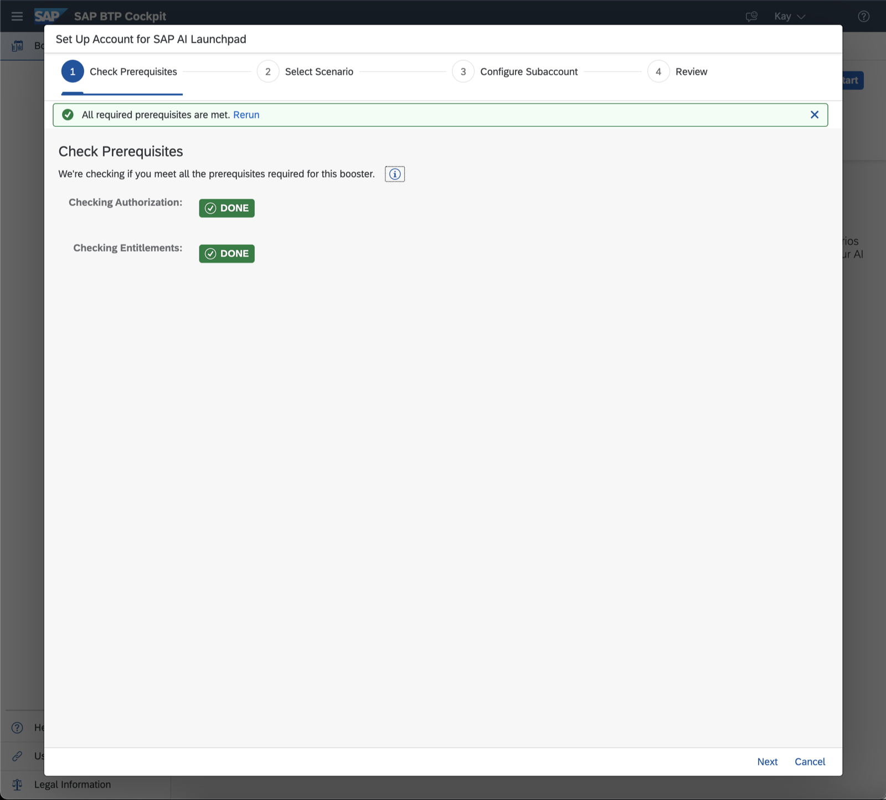
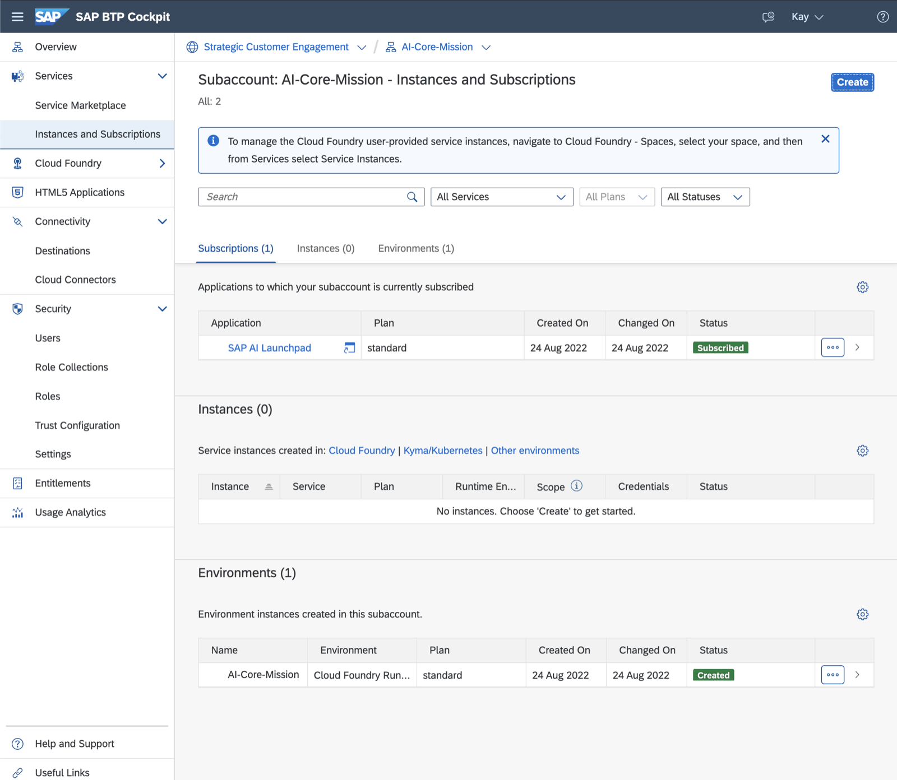

## Prerequisite
[Getting a Global Account](https://help.sap.com/docs/BTP/65de2977205c403bbc107264b8eccf4b/d61c2819034b48e68145c45c36acba6e.html)

## Create Subaccount with SAP AI Launchpad through Booster
Once the prerequisites are met, you can get started to create a subaccount with a subscription to SAP AI Launchpad through the help of a Booster. For this, join your global account and navigate to Boosters. Search for 'AI' to get a list of all available Boosters related to AI.

Choose the Booster for SAP AI Launchpad with the title 'Set Up Account for SAP AI Launchpad' and start it.

Follow the steps in the wizard to finish which triggers the setup of the subaccount with some additional configuration necessary to activate SAP AI Launchpad.

#### Step 1: Check Prerequisites

#### Step 2: Select Scenario

#### Step 3: Configue Subaccount

#### Step 4: Review

#### Progress of Booster

## Inspect Subaccount
After the Booster succeeded, navigate to your freshly created subaccount by clicking on 'Navigate to Subaccount'

The Overview of the Subaccount gives you a summary like meta data or spaces within the subaccount.

Navigate to the _Instances and Subscriptions_ to see the subscription to SAP AI Launchpad.
