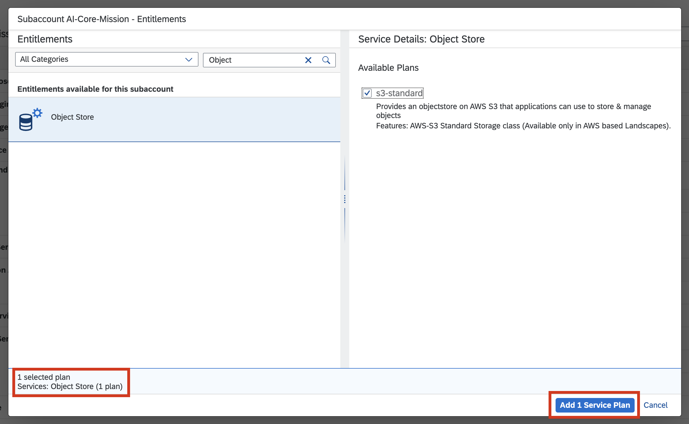
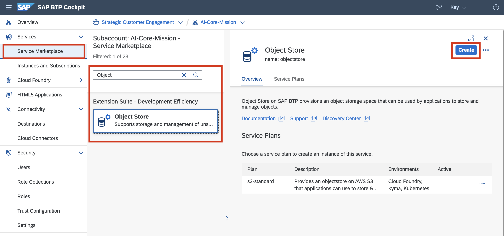
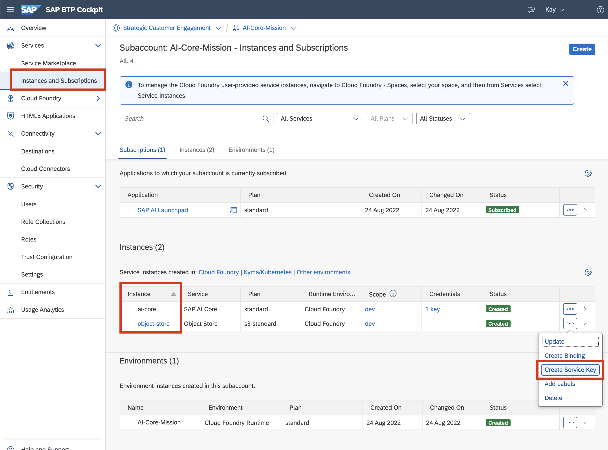

## Add Service Plans for AI Core and Object Store
To leverage the capabilities of AI Core on a subaccount, it's needed to add service plans and give entitlements to be able to create service instances of AI Core and in this case also for Object Store.

Follow the procedure from [Add a Service Plan](https://help.sap.com/docs/AI_CORE/2d6c5984063c40a59eda62f4a9135bee/86002d926eba4fb9ba0a80e342af7295.html?locale=en-US) on 
from the overall guide [Provision AI Core (incl. Subaccount)](https://help.sap.com/docs/AI_CORE/2d6c5984063c40a59eda62f4a9135bee/38c4599432d74c1d94e70f7c955a717d.html?locale=en-US). Since an subaccount for the purpose of AI Launchpad was already created through the booster, it's not necessary to follow the whole guide. Besides adding the service plan and creating an instance only for AI Core, perform the same steps also for Object Store:

### 1. Adding Service Plans

### 2. Create service instance from Marketplace

### 3. Create a Service Key

